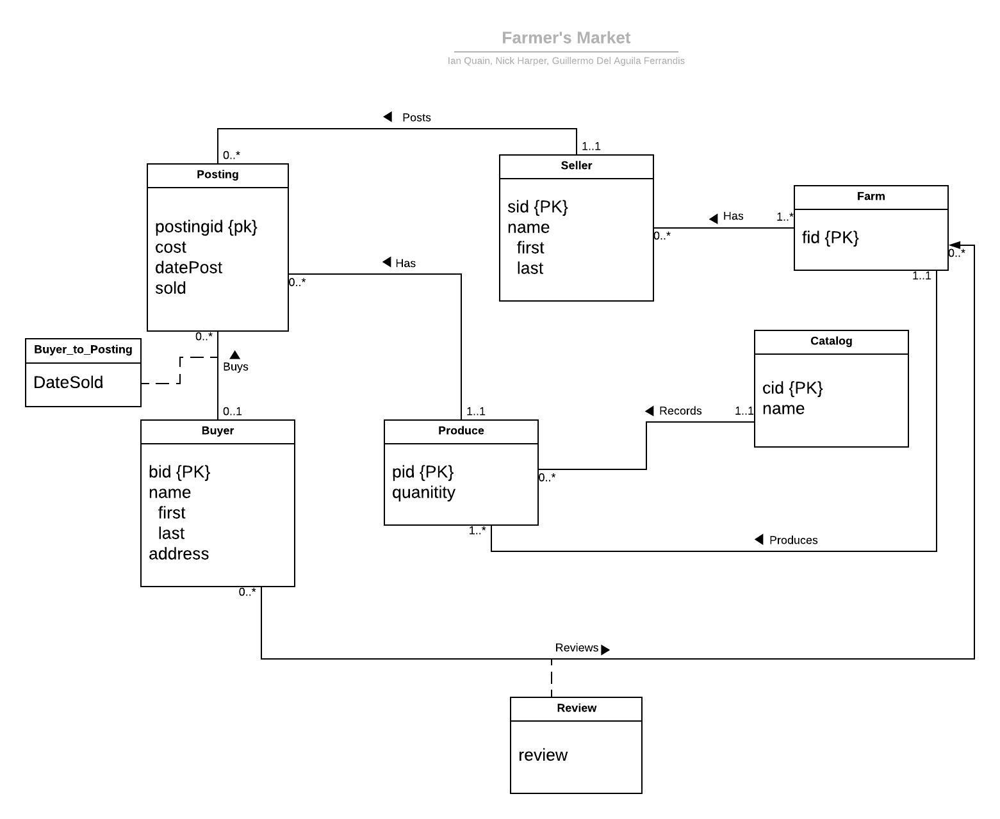

# farmersmarket
A marketplace to connect buyers, seller, and farmers of fresh local produce.

## Installation

Running the Database:
1. Execute fmdump.sql to create the database with given dummy data.

Installing JDBC:
1. Download the MySQL Connector/J (current version 8.0.18): https://dev.mysql.com/downloads/connector/j/
2. Select the ZIP Archive

Building with Eclipse:
1. Open Eclipse, select File → Import... Expand the “Git” folder, select “Projects from Git”, and hit the Next button.
2. On the “Select Repository Source” screen, choose “URI” and enter https://github.com/GuilledelAguila/farmersmarket.git then click Next.
3. Select “Import existing projects” on the “Wizard for project import” page. Hit Next.
4. Select all the projects shown and finish the wizard.
5. You'll have several errors, because you need to configure the build path to have a classpath to your instance of the mysql-connector-java jar. Do do this, right-click the farmersmarket project in Eclipse -> Build Path -> click Configure Build Path. Under classpath, remove the mysql-connector-java jar and add the external jar on your computer from the Connector/J ZIP Archive. After doing that, select the farmersmarket project in Eclipse and hit F5 to refresh it.
6. Use Run as Application to start farmersmarket/fmgui.java

Setting Connection with Database:
1. Inside JavaMySql.java, set userName, password, serverName, and portNumber variables to the respective values to your MySQL account.

## UML

